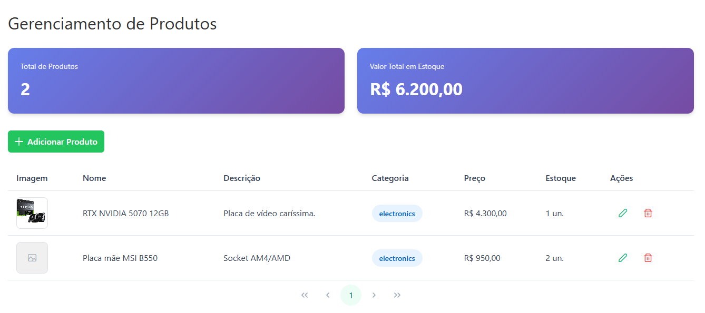
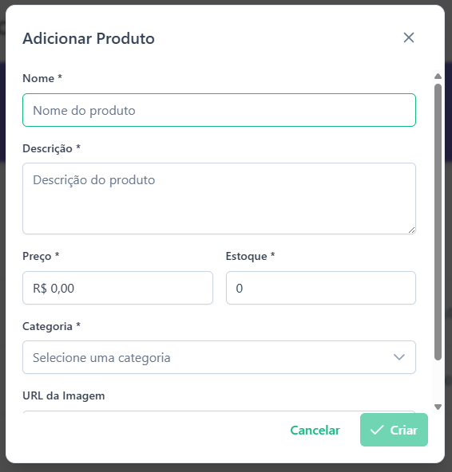
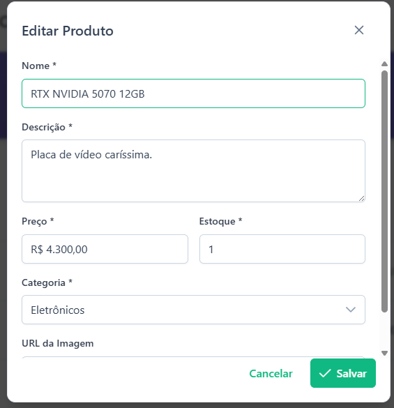
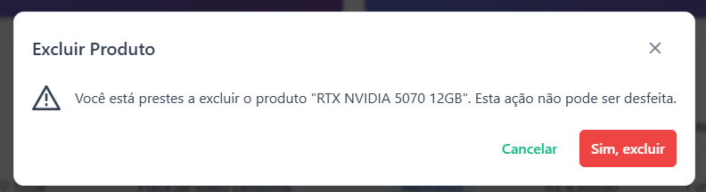
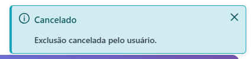
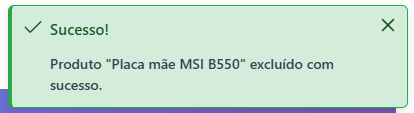

# CRUD Angular (Local)

Aplicação web para gerenciamento de produtos com operações de cadastro, listagem, edição e exclusão.

<p align="left">
	
	
	
</p>

## Sumário

- [Stack](#stack)
- [Funcionalidades](#funcionalidades)
- [Prints da aplicação](#prints-da-aplicação)
- [Como rodar](#como-rodar)
- [Testes](#testes)

## Stack

- Angular 21
- PrimeNG
- Reactive Forms
- Signals
- localStorage

## Funcionalidades

- Cadastro de produtos
- Listagem em tabela com paginação
- Edição de produto em modal
- Exclusão com confirmação
- Feedback visual com mensagens de sucesso/erro
- Persistência local dos dados

## Prints da aplicação

<table>
	<tr>
		<td colspan="2" align="center">
			
		</td>
	</tr>
	<tr>
		<td align="center"><strong>Cadastro de produto</strong></td>
		<td align="center"><strong>Edição de produto</strong></td>
	</tr>
	<tr>
		<td width="50%">
			
		</td>
		<td width="50%">
			
		</td>
	</tr>
	<tr>
		<td colspan="2" align="center"><strong>Confirmação de exclusão</strong></td>
	</tr>
	<tr>
		<td colspan="2" align="center">
			
		</td>
	</tr>
	<tr>
		<td align="center"><strong>Toast de cancelamento</strong></td>
		<td align="center"><strong>Toast de sucesso</strong></td>
	</tr>
	<tr>
		<td>
			
		</td>
		<td>
			
		</td>
	</tr>
</table>

## Como rodar

```bash
npm install
npm start
```

A aplicação ficará disponível em http://localhost:4200/.

## Testes

```bash
npm test -- --watch=false
```
